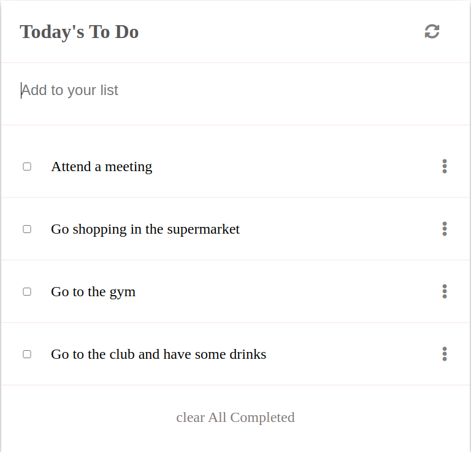

# TODO LIST APPS

`A bare structure of to-do list application. this is the first milestone for this app`

Additional description about the project and its features.

## Built With

- 
- 
- 
- 

## Getting Started
### Instructions on how to run my project locally on your machine
1. Go  to my git repository [TODO_LIST](https://github.com/gabrielcoder247/ToDo-List/milestone-1)
2. then click on download zip folder
3. open the folder on your local machine via code editor
4. if you want to run the project, open it via the browser

👤 **Author**

**GABRIEL NWACHUKWU**

- GitHub: [@githubhandle](https://github.com/gabrielcoder247)
- LinkedIn: [LinkedIn](https://www.linkedin.com/in/gabriel-nwachukwu-209613173/)

## 🤝 Contributing

Contributions, issues, and feature requests are welcome!

## Show your support

Give a ⭐️ if you like this project!

## 📝 License

This project is [MIT](./MIT.md) licensed.
